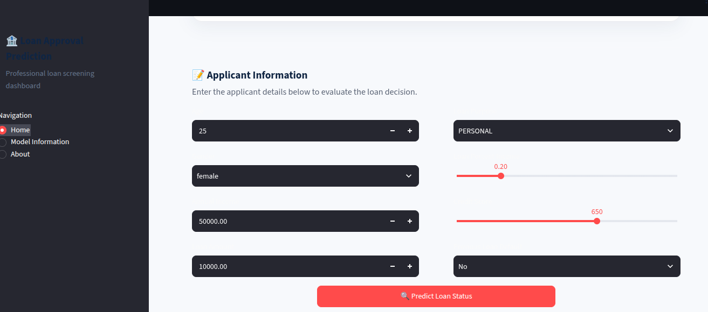
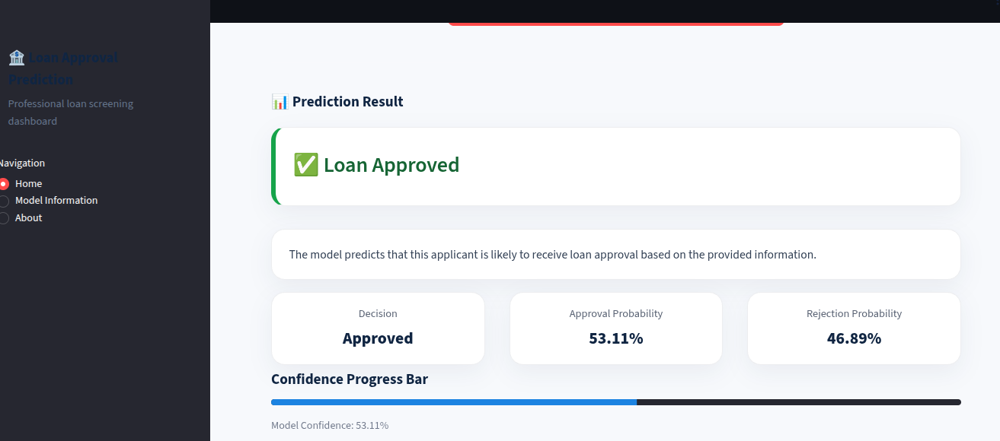
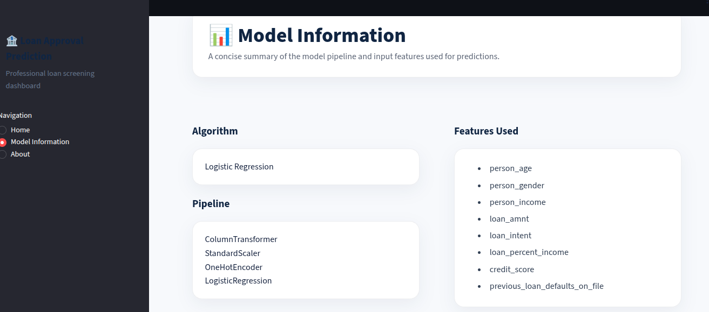
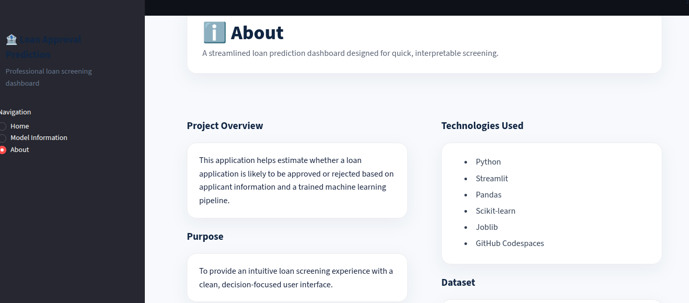

# 🏦 Loan Approval Prediction using Machine Learning

A Streamlit web application that predicts whether a loan application is likely to be **Approved** or **Rejected** using a **Logistic Regression** machine learning model.

The application allows users to enter applicant information through an intuitive interface and instantly receive a prediction along with confidence scores.

---

## 📌 Project Overview

Financial institutions evaluate several factors before approving a loan application. This project demonstrates how Machine Learning can assist in predicting loan approval decisions based on applicant information.

The model is trained using historical loan applicant data and deployed as an interactive Streamlit application.

---

## 🚀 Features

- Predicts Loan Approval or Rejection
- Professional Streamlit Dashboard
- Real-Time Predictions
- Displays Prediction Confidence
- Clean and User-Friendly Interface
- Machine Learning Pipeline Deployment
- Responsive Layout

---

## 🧠 Machine Learning Model

**Algorithm**

- Logistic Regression

**Pipeline Components**

- ColumnTransformer
- OneHotEncoder
- StandardScaler
- Logistic Regression

The preprocessing pipeline is saved together with the trained model, ensuring that user inputs are transformed exactly as they were during training.

---

## 📊 Features Used

The model makes predictions using the following applicant information:

- Person Age
- Person Gender
- Annual Income
- Loan Amount
- Loan Purpose
- Loan Percent Income
- Credit Score
- Previous Loan Default

---

## 🖥️ Application Preview

### Home Page



---

### Prediction Result



---

### Model Information



---

### About Page



---

## 🛠️ Technologies Used

- Python
- Streamlit
- Pandas
- NumPy
- Scikit-learn
- Joblib
- GitHub Codespaces

---

## 📂 Project Structure

```text
loan_approval_prediction_model/
│
├── app.py
├── requirements.txt
├── README.md
├── .gitignore
│
├── models/
│   └── loan_approval_pipeline.joblib
│
├── screenshots/
│   ├── before_prediction.png
│   ├── after_prediction.png
│   ├── model_info.png
│   └── about.png
│
└── dataset/
```

---

## ⚙️ Installation

Clone the repository

```bash
git clone https://github.com/digiusmans/loan_approval_prediction_model.git
```

Navigate to the project directory

```bash
cd loan_approval_prediction_model
```

Install dependencies

```bash
pip install -r requirements.txt
```

Run the application

```bash
streamlit run app.py
```

---

## 📈 Prediction Workflow

1. Enter applicant information.
2. Click **Predict Loan Status**.
3. The trained pipeline preprocesses the input.
4. Logistic Regression predicts the loan status.
5. The application displays:
   - Loan Decision
   - Approval Probability
   - Rejection Probability
   - Model Confidence

---

## 🎯 Future Improvements

- Support additional machine learning algorithms
- Explain predictions using SHAP
- Compare multiple classification models
- Store prediction history
- Deploy with Docker

---

## 👨‍💻 Developer

**Usman Ali**

Machine Learning & AI Engineer

---

## ⭐ Support

If you found this project helpful, consider giving the repository a **Star ⭐** on GitHub.